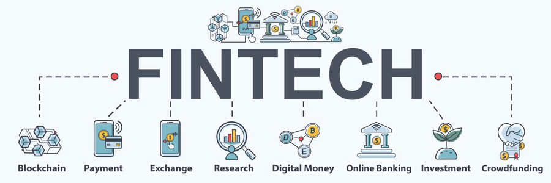
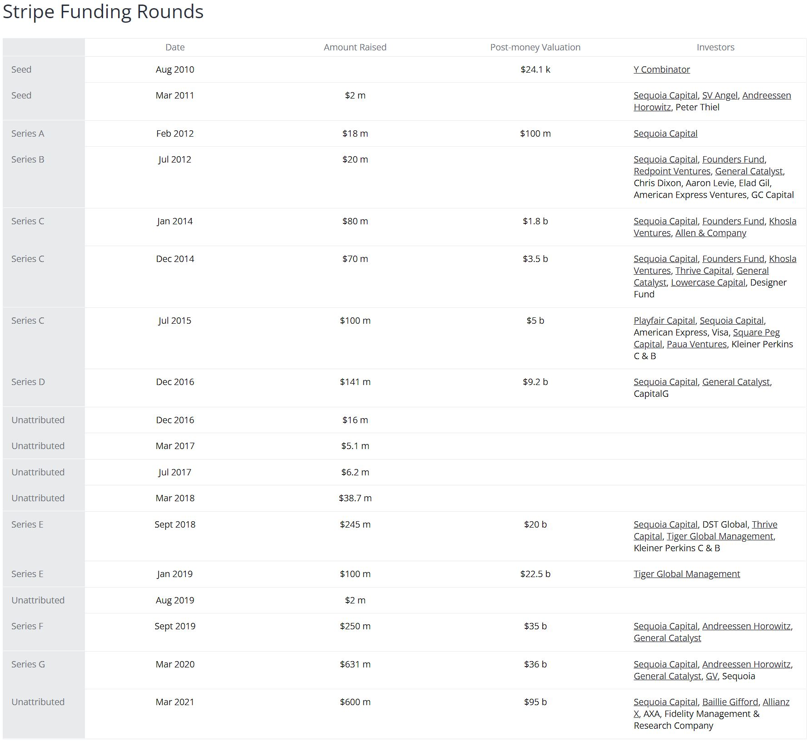

# FinTech Case Study

## Overview and Origin

**Company:** Stripe

**Incorporated:** The company was founded 12 years ago in 2009.

**Founders:** Stripe was founded by brothers John and Patrick Collison.

**Idea:** The idea of the company came about when brothers John and Patrick were trying to figure out why making payments on the web was so diffifcult. Their goal was to make it as simple as possible. 

**Funding:** After coming up with the idea to simplify web payments, they were able to receive funding in 2011 for $2 million to get started. They have received over $2.2 billion over the past 12 years.

---

## Business Activities:

* This company is trying to make payments on the web as simple as possible. Creating a platform for anyone to simplify e-commerce.

* Stripe's intended customers are anyone who needs to make or receive a payment. Their target market is small startups to giant corporations in need of payment services. Stripe was one of the first companies to offer digital first payment processing. They have kept a positive reputation in the market and is a top choice for most developers. Having large market share compared to competitors, it makes it an easier choice for startups to choose a reputable company.

* According to Stackshare, Stripe is using; Ruby, programming language; NSQ, messaging platform; Google Analytics along with many others for research.

## Landscape:

* Stripe would fall under the Payments/Billing domain in FinTech. 

* Payments/Billing domain in Finance have been one of the most affected by technology in the past 10 years. Starting with the rise of smartphones about 10 years ago we have moved from physical payments with cash or credit cards to mobile payments with our phone.

* Some other companies in this domain are PayPal, Square, WePay and Klarna.

## Results

* The impact of stripe has been enormous. With commerce shifting online, stripe was there to facilitate payments. Also the pandemic had a huge impact on e-commerce. 

* There are a few different ways to measure success for a company like Stripe. We can look at overall market share and customers to start. They have about 12% market share for all online payments. Besides market share, Stripe has over 118,000 companies as customers. 

* Stripe is performing very well compared to competitors. They had an advantage of being one of the first to market and have stayed ahead for the most part. 

## Recommendations

* If I were to advise Stripe, I would recommend they offered a service similar to Venmo(free peer to peer money transfer), they could become a household name. Smaller startups and cash heavy businesses have recently started accepting Venmo payments and as they grow, they will most likely stick with PayPal.

* A free service like Venmo could help build even more market share. That could potentially create growth over time and make sure they stay dominant in a very competitive field.

* This type of additional service would not require any new technologies. A bit of coding and the service could be enabled. 

-----

### Sources:

https://www.startupgrind.com/blog/the-collison-brothers-and-story-behind-the-founding-of-stripe/

http://en.wikipedia.org/wiki/Stripe_(company)

https://www.crunchbase.com/organization/stripe/company_financials

https://stackshare.io/stripe/stripe

https://purple.ai/blogs/seven-ways-technology-has-developed-over-the-last-10-years/

https://craft.co/stripe/funding-rounds

https://stripe.com/

https://www.google.com/search?q=stripe&sxsrf=AOaemvIRHRvz2hUrcnesJ5Fgvc8GFnLTJw:1633202791105&source=lnms&tbm=isch&sa=X&ved=2ahUKEwjfrtbBuqzzAhWZElkFHW7xDswQ_AUoAnoECAEQBA&biw=1281&bih=538&dpr=1.5#imgrc=qqBtpCMBTLCptM

https://www.google.com/search?q=fintech&tbm=isch&ved=2ahUKEwjzxrnDuqzzAhX6qnIEHQ5wAy8Q2-cCegQIABAA&oq=fintech&gs_lcp=CgNpbWcQAzIHCCMQ7wMQJzIFCAAQgAQyBQgAEIAEMgUIABCABDIFCAAQgAQyBQgAEIAEMgUIABCABDIFCAAQgAQyBQgAEIAEMgUIABCABDoICAAQgAQQsQM6BAgAEEM6BwgAELEDEEM6CwgAEIAEELEDEIMBUM_8AVj7ggJgsYQCaABwAHgAgAFFiAGnA5IBATeYAQCgAQGqAQtnd3Mtd2l6LWltZ8ABAQ&sclient=img&ei=arJYYfPpMfrVytMPjuCN-AI&bih=538&biw=1281

